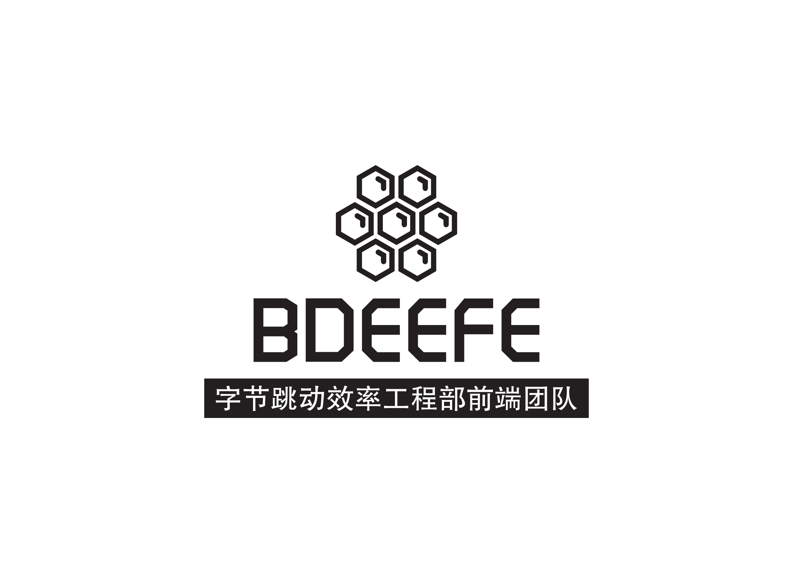

# BDEEFE

## 背景

字节跳动效率工程部前端团队（ByteDance Efficiency Engineering FrontEnd），拥有很多优秀前端工程师，产出了不少的优秀工具库与组件库。我们希望将这个团队推向前端社区，向整个社区展现我们的技术实力，分享我们的技术成果。

## 寓意

组织的 Logo 设计成蜂窝状，具有如下象征意义：

- 整个 BDEEFE 是由分布在全国各地的前端团队组成，是个去中心化的组织；而蜂窝状的六边形组合是十分稳定的系统，表示虽然我们组织是分布式的，但是团队本身是十分稳固的；
- 整个 BDEEFE 的技术产出也是各个团队共同协作的结果，以蜂窝和工蜂做象征，表示团队的成果是各个团队成员辛苦协作的结果；
- 蜂窝状的六边形组合乃是大自然界中使用效率最高的形式，表征效率工程部所做的事情，正是为了提升组织的效率。

选择棱角分明的液晶英文字体突出 BDEEFE，体现出工程师严谨求实的态度，以及程序员特有的极客式浪漫。

## 资源

- [品牌资源](./BRAND.md)

## 社区

- [掘金](https://juejin.im/user/5c78cf4d6fb9a049af6df72b/)
